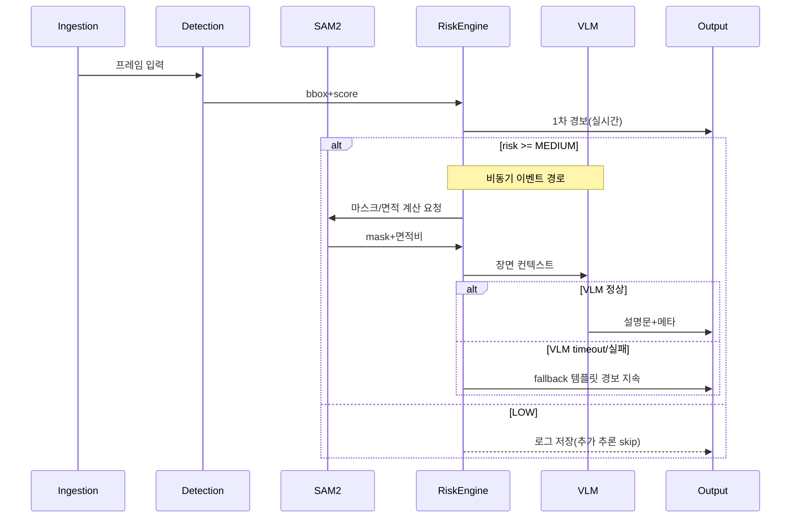
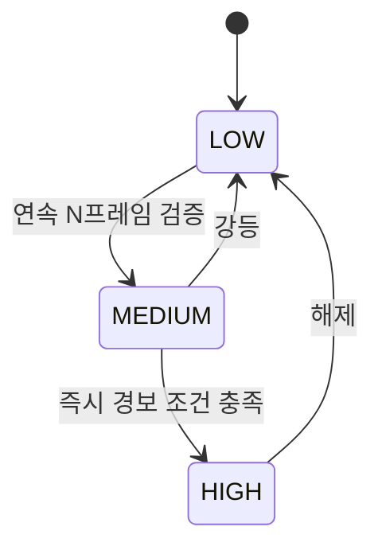

# RBLN NPU 배포 보강본 (Slide 2장 + 상세 버전)

---

## [A] Slide 2장 분량 버전

### Slide 1. 모델 구성 + 2-Tier 데이터 흐름 (YOLO 1차 검출 전제)

```mermaid
flowchart LR
  subgraph E["Edge 노드(실시간 1차 경보)"]
    I["Ingestion<br/>CCTV/드론"]
    D["Detection<br/>YOLOv8n/v8m"]
    R["Risk Engine"]
    ER["Event Router<br/>(MEDIUM/HIGH)"]
    S["Segmentation<br/>SAM2 (event-only)"]
    B["주 병목 후보<br/>(현재: frame_load)"]
    X["scale-out<br/>(edge detector pool)"]

    I --> D
    D -->|bbox+score| R
    R --> ER
    ER -->|MEDIUM/HIGH| S
    S -->|mask+면적비| R
    B -.-> D
    X -.-> D
  end

  subgraph C["중앙 관제 클라우드"]
    ER["Event Router"]
    V["VLM<br/>Qwen2.5-VL-7b"]
    L["LLM<br/>A.X-4.0-Light 등"]
    O["Output/API<br/>대시보드·SMS·119"]
  end

  ER -->|장면 컨텍스트(MEDIUM/HIGH)| V
  ER -.->|LOW(우회)| O
  V -->|생성문+메타| O
  V -.->|요약/정제(선택)| L
  L -.->|요약문(선택)| O

  classDef bottleneck fill:#ffe3e3,stroke:#d32f2f,stroke-width:2px,color:#7f0000;
  class D bottleneck;
```

#### 1) 사용 모델 (YOLO 조합 기준)
- 1차 Detection(실시간): **YOLOv8n/v8m** (기본: YOLOv8n mock, 선택: ultralytics)
- Segmentation(이벤트 경로): **SAM2** (MEDIUM/HIGH에서만 호출)
- VLM(설명): **Qwen 계열 백엔드** (조건부 호출 + fallback)
- LLM: 미구현(옵션 경로)

> 주석(중요성): 실시간 경보 경로를 YOLO 중심으로 단순화해 edge 지연/운영 복잡도를 낮춘다.

#### 1-1) 실험에서 실제 사용된 모델/체크포인트 (코드·실험 설정 기준)
| 스테이지 | 실제 사용 식별자 | 근거 |
|---|---|---|
| Detection (YOLO mock) | `YOLOv8n` + backend=`mock` | `experiments/results/runpod_host_mock_vlm/performance_summary.json` |
| Detection (YOLO real) | `YOLOv8n`/`YOLOv8m` + backend=`ultralytics` | `experiments/results/runpod_yolov8n_vlm/performance_summary.json`, `experiments/results/runpod_yolov8m_vlm/performance_summary.json` |
| Segmentation | `SAM2Wrapper` (event-triggered, 현재 실험은 SAM2 mock fallback 비중 포함) | `experiments/results/runpod_host_mock_vlm/alerts.json` |
| VLM | `Qwen2.5-VL-7B` (event-gated, 현재 backend fallback 포함) | `experiments/results/runpod_host_mock_vlm/alerts.json`, `experiments/results/split_service_mock_vlm/alerts.json` |
| LLM | 미구현(미사용) | 현재 코드 경로에 LLM 호출 없음 |

> 주석(중요성): 발표/리뷰 시 "설계 모델명"과 "실험에 실제 탑재된 모델"을 분리해 명시해야 재현성과 검증 신뢰도가 올라간다.

#### 2) 모델별 점유/배치 산정 (가정값)
| 모델 | 종류 | 예상 NPU 수 | 배치 칩(ATOM-Lite/ATOM/ATOM-Max) | 엣지/중앙 | 서빙스택(rebel-compiler/optimum-rbln/vllm-rbln) |
|---|---|---:|---|---|---|
| YOLOv8n/v8m | Detection | 확인 불가 | 확인 불가 | 엣지 | ultralytics (현재 로컬 검증 경로) |
| SAM2 | Segmentation | 1~2 (가정값) | ATOM (메모리 여유 시 Lite 가능) | 엣지/중앙 공용 | rebel-compiler + torch.compile(rbln) |
| Qwen2.5-VL-7B | VLM | 8 (문서/예제 기준) | ATOM-Max 권장 | 중앙 | rebel-compiler + optimum-rbln + vllm-rbln |
| A.X-4.0-Light | 한국어 LLM | 4~8 (문서 기준) | ATOM-Max 권장 | 중앙 | rebel-compiler + optimum-rbln + vllm-rbln |

> 주석(중요성): NPU 점유를 선제 산정해야 서비스 시작 전에 카드 수/스케일 전략/비용을 계산할 수 있다.  
> 주석: `YOLOv8`의 RBLN 배치 경로/권장 칩 수는 본 문서 기준 **확인 불가**이며, 현재 결과는 ultralytics 실행 기반이다.

#### 3) 2-Tier 데이터 흐름
- **실시간 경로(1차 경보)**: Ingestion -> YOLO(bbox+score) -> Risk Engine -> LOW/즉시 경보
- **이벤트 경로(품질/설명 강화)**: MEDIUM/HIGH만 Event Router -> SAM2(mask/area) -> Risk 재평가 -> VLM 설명 -> Output/API

> 주석(중요성): 실시간 경로를 가볍게 분리하면 NPU 혼잡 시에도 경보 SLA를 먼저 지킬 수 있다.

#### 4) 모델 연동 인터페이스 (평가 체크용)
| 연동 | 출력(생산자) | 입력(소비자) | 변환/규약 | 호출 |
|---|---|---|---|---|
| YOLO -> Risk | `bbox`, `score`, `label`, `frame_id`, `timestamp` | detector signal | 규약: detection dict 표준화 | 동기 |
| Risk -> Event Router | `risk_level`, `avg_conf`, `consecutive_frames` | event gate | MEDIUM/HIGH만 event 경로 진입 | 동기 |
| Event Router -> SAM2 | 이벤트 프레임 + bbox | box prompt | YOLO bbox를 SAM2 박스 프롬프트로 주입 | 조건부 |
| SAM2 -> Risk | mask | 면적비/성장률 feature | 마스크 픽셀 통계로 feature 산출 | 동기 |
| Risk -> VLM | risk score, bbox, mask feature | 설명 입력 | 이벤트 프레임 조건부 호출 | 조건부 |
| VLM -> LLM | 이벤트 설명문 | 통합 요약 입력 | N개 이벤트 텍스트 집계 후 요약 | 비동기 |

> 주석(중요성): 컴포넌트 간 I/O 계약을 표로 고정하면 배포/테스트/장애분석 시 인터페이스 불일치를 빠르게 찾을 수 있다.

#### 4-1) 구간별 입출력 상세 표 (현재 코드 경로 기준)
| 구간 | 입력 | 출력 | 스킵 조건 | 산출 위치 |
|---|---|---|---|---|
| Ingestion -> Frame Loader | video path, frame_stride | `frame_id`, `timestamp`, `image_bgr` | 없음 | `performance.json`의 `frame_load_ms` |
| Frame -> YOLO Detector | `image_bgr`, `frame_id`, `timestamp` | `[{label, score, bbox, frame_id, timestamp, source_model}]` | detector 미설정 시 실패 | `alerts.json`의 `detected_labels`, `confidence` |
| YOLO -> Risk Engine(1차) | detections(avg_conf), temporal count | `risk_level`, `alert_message` | detections 비어도 LOW 평가 | `alerts.json`의 `risk_level` |
| Risk -> Event Router | `risk_level`, detections 존재 여부 | `event_triggered` boolean | `LOW` 또는 no detection이면 false | `alerts.json`의 `event_triggered`, `performance`의 `event_router_ms` |
| Event -> SAM2 | `image_bgr`, bbox list | mask list, `mask_area_ratio`, `region_count`, `mask_growth` | `event_triggered=false`면 skip | `alerts.json`의 `sam2_used`, `mask_area_ratio`, `mask_growth` |
| Risk Re-score(2차) | avg_conf + SAM2 feature | 업데이트된 `risk_level`, `alert_message` | SAM2 skip 시 1차 risk 유지 | 최종 `alerts.json` |
| Risk -> VLM | detections + risk + bbox/mask metadata | `explanation`, `vlm_used` | VLM 조건 미충족 시 fallback | `alerts.json`의 `explanation`, `vlm_used` |
| Final Output/API | frame/meta + risk + explanation | per-frame alert record | 없음 | `alerts.json`, `performance_summary.json` |

> 주석(중요성): 구간별 입출력/스킵 조건을 고정하면 이벤트 기반 추론(SAM2/VLM)의 호출량·비용·지연을 운영 중에도 추적 가능하다.

---

### Slide 2. 병목/리스크 + SLA + 고객 가치





#### 1) 현재 관찰(측정 근거)
- **측정 환경**: RunPod host Python/GPU + split-service simulation + Docker availability check
- **중요 주의**: 아래 수치는 RBLN NPU runtime 결과가 아니라 host/GPU/mock 기준 아키텍처 검증 수치다.
- **[YOLO 기준] 현재 관찰 병목**
  - `runpod_host_mock_vlm`: `frame_load` avg **366.958ms**, `event_count=8`, `vlm_used_count=8`
  - `runpod_yolov8n_vlm`: `visualization` avg **390.016ms**, `yolo_inference` avg **306.002ms**, `event_count=0`
  - `runpod_yolov8m_vlm`: `frame_load` avg **363.472ms**, `yolo_inference` avg **105.649ms**, `event_count=0`
  - `split_service_mock_vlm`: `frame_load` avg **393.989ms**, `queue_wait` avg **0.0ms**
  - `docker_yolov8n_vlm`: `status=NOT_MEASURED`, `actual_runtime=not_measured`
- **[미구현] LLM은 코드 경로에 실제 호출이 없고**, 다중 카메라 통합 요약을 위한 설계상 확장 옵션이다.

| 실험 | YOLO avg(ms) | SAM2 avg(ms) | VLM avg(ms) | Queue wait avg(ms) | bottleneck_stage |
|---|---:|---:|---:|---:|---|
| runpod_host_mock_vlm | 0.1058 | 0.9926 | 0.0530 | null | frame_load |
| runpod_yolov8n_vlm | 306.0017 | 0.0005 | 0.0118 | null | visualization |
| runpod_yolov8m_vlm | 105.6490 | 0.0006 | 0.0153 | null | frame_load |
| split_service_mock_vlm | 0.0695 | 1.6416 | 0.0278 | 0.0 | frame_load |
| docker_yolov8n_vlm | null | null | null | null | NOT_MEASURED |

> 출처: `experiments/results/runpod_host_mock_vlm/performance_summary.json`, `experiments/results/runpod_yolov8n_vlm/performance_summary.json`, `experiments/results/runpod_yolov8m_vlm/performance_summary.json`, `experiments/results/split_service_mock_vlm/performance_summary.json`, `experiments/results/docker_yolov8n_vlm/performance_summary.json`

> 주석(중요성): GPU 결과를 기준선으로 삼아 NPU 전환 후 병목 이동 여부를 비교할 수 있다.

#### 2) NPU 배포 시 예측 리스크
- (a) **정적 shape 컴파일/bucketing 필요**
- (b) **dynamo graph break 발생 시 host-device 전송 증가**
- (c) **병목 순위 이동 가능성**(Detection -> VLM/메모리/입출력)

- **[재검증 필요]** GPU에서 측정된 병목 순위는 NPU 배포 시 정적 shape 컴파일 조건과 host-device 전송 특성 차이로 이동할 수 있으므로, 배포 전 `RBLN Profiler`로 stage별 재프로파일이 필요하다.

> 주석(중요성): NPU는 컴파일/그래프 안정성이 성능 편차를 크게 만들므로 재프로파일이 운영 안정성의 핵심이다.

#### 3) 병목/리스크 지점과 대응
- **Risk 1 — [YOLO 기준] frame_load/입출력 병목**  
  - 실측: YOLO 계열 실행에서 병목이 `frame_load`로 이동  
  - 대응: 디코딩/리사이즈 파이프라인 최적화, 비동기 프레임 prefetch, 저장 I/O 분리
- **Risk 2 — SAM2 이벤트 경로 지연**  
  - 대응: MEDIUM/HIGH 이벤트에서만 호출 유지, 큐 기반 비동기 처리
- **Risk 3 — VLM 지연/비용 병목**  
  - 대응: 이벤트 기반 호출(MEDIUM/HIGH + interval), timeout+fallback 유지
- **Risk 4 — 탐지 정확도 리스크**  
  - 현황: COCO pretrained YOLO는 wildfire 특화 클래스 부재  
  - 대응: smoke/fire 파인튜닝 모델 + 데이터셋 기반 재학습/평가

#### 3-1) 최적화 우선순위 (현재 측정 기준)
| 우선순위 | 최적화 대상 | 현재 근거 | 권장 액션 |
|---|---|---|---|
| P0 | `frame_load` (프레임 로드/디코딩 I/O) | host/split 실험에서 반복적으로 최대 구간 | 비동기 prefetch, 디코더 파이프라인 분리, 저장 I/O 비동기화 |
| P1 | visualization/overlay 경량화 | `runpod_yolov8n_vlm`에서 visualization 지배 | overlay 비동기화, 저장/write path 분리 |
| P2 | YOLO detector latency (`yolo_inference`) | n/m 비교 시 detector 비용 변동 큼 | edge 기본값 `yolov8n` 유지 + 해상도/배치 튜닝 |
| P3 | Event 경로 호출률 제어 (SAM2/VLM) | mock에서 event 8회 호출 확인, real은 event 0회 | threshold/interval 재설정 후 event stress run 추가 |
| P4 | SAM2 실모델 경로 | 현재 실험은 SAM2 mock fallback 비중 존재 | 실가중치 로드 후 stage p95/p99 재측정 |
| P5 | VLM 비용/지연 | 이벤트 시 조건부 호출 구조 | timeout+fallback 고정, max tokens 상한 유지 |

> 주석(중요성): 현재는 detector 자체보다 I/O가 우선 병목이므로, 프레임 파이프라인 최적화가 전체 FPS 개선에 가장 직접적이다.

#### 4) SLA placeholder (초기 목표)
- End-to-End 지연 목표: **p95 <= [TBD] ms**
- 카메라당 처리율 목표: **>= [TBD] FPS**
- VLM timeout: **<= [TBD] ms** (timeout 시 fallback 응답)

> 주석(중요성): 정량 SLA를 먼저 못 박아야 모델 정확도 개선과 운영비 최적화를 같은 기준으로 평가할 수 있다.

#### 5) 고객 가치
- 조기 경보(초기 대응 시간 단축), 이벤트 기반 VLM 호출(비용 절감), fallback 기반 서비스 연속성 확보

> 결론: 실시간 경보는 Detection 중심으로, 설명/요약은 비동기로 분리한 RBLN NPU 아키텍처가 지연·비용·안정성 균형에 유리하다.

---

## [B] 디테일 보강 버전 (설계/운영 문서용)

### 1) 모델/경로 검증 관점
- Qwen2.5-VL, A.X-4.0-Light는 `huggingface/transformers` + `optimum-rbln` 컴파일 경로를 사용
- SAM2는 `pytorch_dynamo/.../sam2/main.py` 기반 `torch.compile(backend="rbln")` 경로 사용
- YOLO는 현재 `ultralytics` 실행 경로로 동작하며, RBLN 컴파일 경로는 별도 검증 필요

> 주석(중요성): 모델별 컴파일 경로가 다르면 장애 유형과 튜닝 포인트(정적 shape, graph break)도 달라진다.

### 2) 서비스 배치 전략 (Edge/중앙)
- **Edge(현장)**: YOLOv8 중심 저지연 1차 경보
- **Central(관제)**: SAM2 + VLM(+선택 LLM)로 이벤트 후처리/설명/리포팅
- 메시지 큐(Kafka/RabbitMQ)로 실시간/비동기 경로 분리, 역압(backpressure) 제어

> 주석(중요성): Edge-중앙 분리로 네트워크 품질 변동에도 경보 기능을 유지할 수 있다.

### 3) 병목 대응을 RBLN 스택 기준으로 재정의
- 기존 TensorRT/ONNX 언급 대신:
  - `rebel-compiler` 컴파일 옵션 튜닝
  - `optimum-rbln`의 tensor parallel / seq len / batch 파라미터 튜닝
  - `vllm-rbln`의 max model len, block size, timeout 정책 튜닝
  - `torch.compile(rbln)` 경로에서 graph break 최소화

> 주석(중요성): 도구체인을 RBLN 기준으로 통일해야 운영 자동화와 문제 재현성이 확보된다.

### 4) NPU 배포 체크리스트 (Next Step)
1. 모델별 컴파일 산출물 생성 및 로드 테스트
2. Shape bucket 설계(해상도/토큰 길이)와 fallback 정책 검증
3. RBLN Profiler로 stage별 p50/p95/p99 측정
4. 병목 재정렬 후 NPU 재배치(Edge/중앙) 재확정
5. SLA placeholder를 실제 숫자로 고정 후 운영 알람 연동
6. I/O(`frame_load`) 개선 전/후 A/B 측정(동일 영상·동일 stride)
7. Event Router 임계값 변경에 따른 `sam2_used_count`, `vlm_used_count` 비용 곡선 산출

> 주석(중요성): 프로파일-재배치-재검증 루프가 없으면 실서비스에서 성능 회귀를 조기에 잡기 어렵다.
